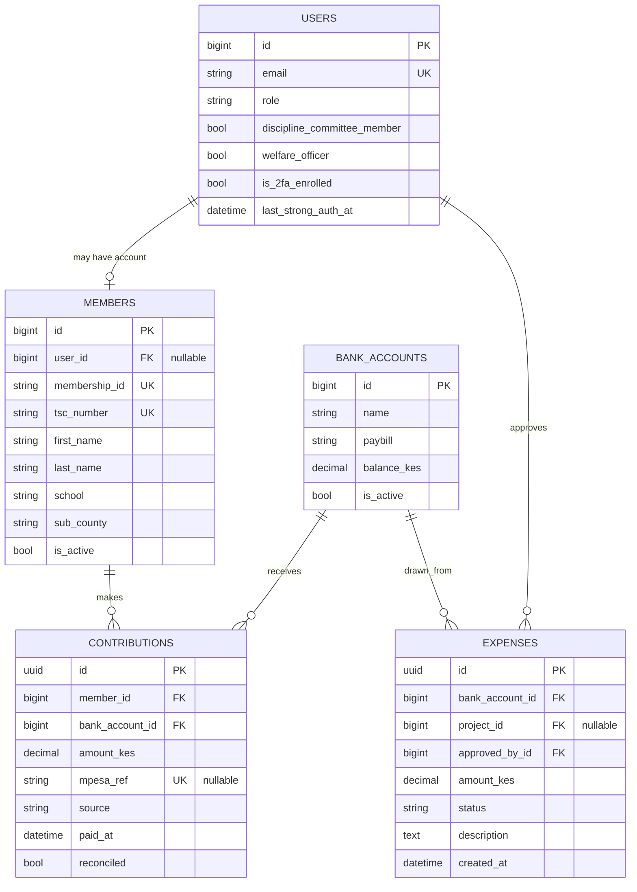
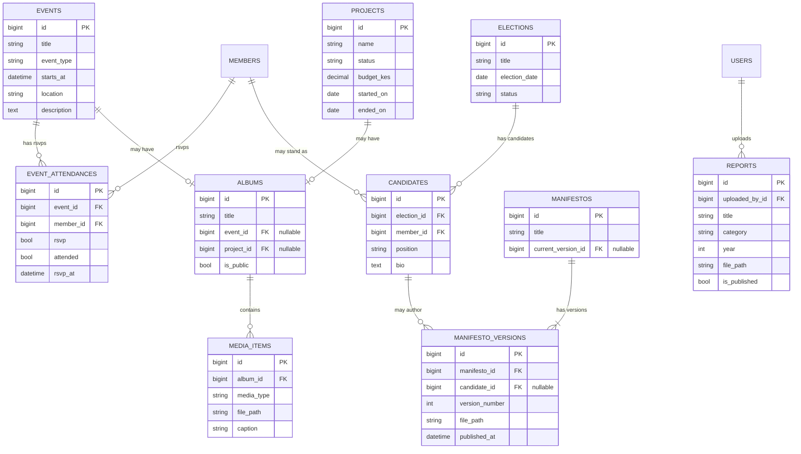
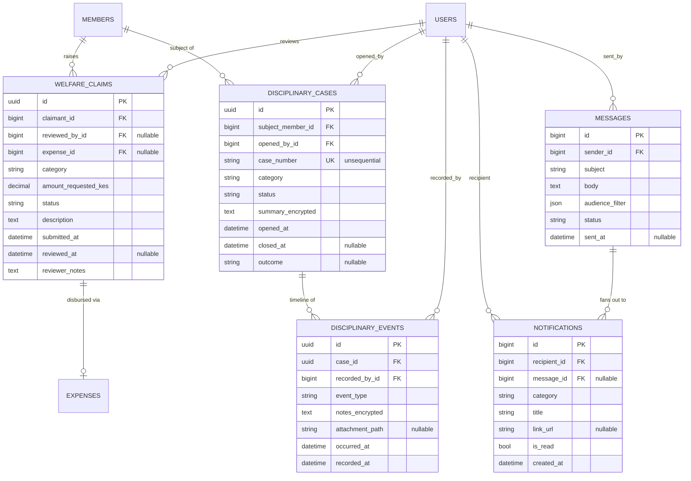

# KUPPET MSA — Entity-relationship diagrams

**Status:** v0.1 — companion to `docs/PLAN.md` §7 and `docs/permissions.md`.
**Diagram format:** [mermaid.js `erDiagram`](https://mermaid.js.org/syntax/entityRelationshipDiagram.html). Rendered natively by GitHub when you view this file on the repo page. Anyone with a mermaid-capable editor (VS Code with the Mermaid Preview extension, Obsidian, etc.) can also render locally.

The schema is split into three sub-diagrams because a single 20-entity ERD is
unreadable. Cross-diagram references are noted in prose. Together they cover
every entity that will exist when v2 reaches launch — phase by phase, only
the tables for the phase we're in get migrated.

A cardinality crash course for reading the diagrams:

- `||--o{` — exactly one on the left, zero-or-many on the right
- `||--o|` — exactly one on the left, zero-or-one on the right (optional 1-to-1)
- `||--|{` — exactly one on the left, one-or-many on the right (mandatory 1-to-many)
- `}o--o{` — many-to-many (zero-or-many on both sides)

---

## 1. People & money

The bedrock. Users may or may not be members; members raise contributions
into bank accounts; expenses flow back out of those accounts and (optionally)
charge against a project.

**Design notes:**

- `MEMBERS.user_id` is **nullable**. A member may exist in the registry
  (imported from the branch's TSC roster) without ever logging in. Conversely,
  a `USER` with `role=admin` may not be linked to any member record.
- `CONTRIBUTIONS.mpesa_ref` is **nullable** because manual entries (cash,
  bank transfer) won't have one. `source` carries the channel
  (`mpesa_c2b`, `mpesa_stk`, `manual_cash`, `bank_transfer`) so reconciliation
  logic can branch on it.
- `CONTRIBUTIONS.reconciled = False` is the unmatched-payment queue the
  treasurer reviews. The auto-reconciler matches by `membership_id` from
  the M-Pesa account reference; anything ambiguous lands here.
- `EXPENSES.project_id` is **nullable** — not every expense is project-tagged
  (e.g. general office costs).
- `EXPENSES.approved_by_id` is **mandatory**. There is no such thing as an
  expense without an approving officer. The two-person rule (§6.1 of
  `permissions.md`) is enforced at the application layer: if the same user
  is the creator and the would-be approver, the action is blocked.
- UUID PKs on the two money tables. Sequential integer IDs leak transaction
  volume and ordering — for union finances that's a real privacy concern.
- A `protect` cascade on `BANK_ACCOUNTS` and `MEMBERS` from
  `CONTRIBUTIONS`/`EXPENSES`: you cannot delete an account or member that
  has financial history. Deactivate instead.

---

## 2. Engagement & content

Public-facing material: events, projects, reports, gallery, manifestos,
elections. None of this is sensitive on its own — the privacy work is in
the next diagram. The interesting structural choice here is the
`MANIFESTO → MANIFESTO_VERSIONS` split.

**Design notes:**

- A `MANIFESTO` is the conceptual document
  ("KUPPET Mombasa 2024 Chairperson Manifesto"); `MANIFESTO_VERSIONS` are
  immutable revisions. Publishing a new version inserts a row and updates
  `MANIFESTOS.current_version_id` — old versions remain forever, so
  historical campaigns stay browsable. **Never UPDATE a published manifesto
  in place.**
- `MANIFESTO_VERSIONS.candidate_id` is nullable because not every manifesto
  is tied to a single candidate — a branch-wide policy manifesto belongs to
  the chapter, not a person.
- `ALBUMS` has two nullable FKs (`event_id`, `project_id`) and at most one
  can be set, enforced by a `CheckConstraint`. Standalone galleries
  (no event row, no project row) are permitted by both being null.
- `EVENT_ATTENDANCES` is a real model, not a `ManyToManyField` through
  the implicit table. We need the RSVP-vs-attended distinction (people who
  said they'd come and did, said they would and didn't, just turned up,
  etc.) and a timestamp on each row.
- `REPORTS.uploaded_by_id` points to `USERS`, not `MEMBERS`. Officers who
  upload reports may not all be members of the branch.
- `EVENTS.starts_at` is nullable in the v1 schema; v2 keeps it that way
  because the gallery use case ("we held an event but the exact time isn't
  on record") needs to work.

**Cross-diagram link:** `PROJECTS.id` is referenced by `EXPENSES.project_id`
from the People & money diagram. That's how the public transparency page
computes "project budget vs actual spend" — sum `EXPENSES.amount_kes` where
`project_id = X` and compare to `PROJECTS.budget_kes`.

---

## 3. Sensitive & comms

The most security-sensitive corner of the schema (welfare, discipline) sits
alongside communications. Two separate stories, drawn together because they
share the same `USERS` / `MEMBERS` references and the diagram stays
compact.

**Design notes:**

- `WELFARE_CLAIMS.expense_id` closes the loop into the finance system.
  When a claim is approved and paid, an `Expense` row is created and
  back-linked here. The transparency dashboard surfaces aggregate welfare
  disbursements as a public spend category — totals only, no claimant names.
- `WELFARE_CLAIMS.status` state machine:
  `submitted → under_review → (approved | rejected) → paid`. Each transition
  is audit-logged with who/when. Withdrawal by the claimant only allowed
  while `status = submitted`.
- `DISCIPLINARY_CASES.case_number` is marked `unsequential` — that's a
  column comment, not a Django field type. Generate via `secrets.token_hex(4)`
  (8 hex chars) or `uuid4().hex[:8]`. **Never via a counter.** Sequential
  case numbers leak case-existence and approximate timing.
- `DISCIPLINARY_CASES.summary_encrypted` and `DISCIPLINARY_EVENTS.notes_encrypted`
  are wrapped with `django-cryptography-django5` so the database rows hold
  ciphertext. Application-layer decryption only happens for users who pass
  the `IsDisciplineCommittee` permission. Plain-text fields like `category`,
  `status`, `outcome` stay searchable.
- `DISCIPLINARY_EVENTS` is append-only in practice. There's an `edit` view
  but it's window-limited (1 hour after `recorded_at`) and the original is
  preserved in the audit log. The model itself doesn't enforce
  immutability — the *viewset* does.
- `MESSAGES → NOTIFICATIONS` is a fan-out: one officer broadcast becomes one
  `Message` plus N `Notification` rows (one per targeted member).
- `NOTIFICATIONS.message_id` is nullable because notifications also originate
  from system events (welfare-claim status changed, RSVP confirmed, etc.)
  without a parent message.
- `MESSAGES.audience_filter` is a JSON spec: `{"roles": [...], "schools": [...],
  "sub_counties": [...], "active_only": true}` — interpreted by the
  notification-fan-out task to compute recipients at send time.

**Cross-diagram links:**

- `WELFARE_CLAIMS.expense_id → EXPENSES.id` (People & money)
- `DISCIPLINARY_CASES.subject_member_id → MEMBERS.id` (People & money)
- `MESSAGES.sender_id` and most `*.recorded_by_id` / `*.opened_by_id` /
  `*.reviewed_by_id` → `USERS.id`

---

## 4. What's not modelled here

A few things deliberately left out of the v2 schema, listed so anyone
reviewing the ERDs doesn't go looking for them:

- **No `AuditLogEntry` table in these ERDs.** `django-auditlog` ships its
  own `LogEntry` model with a GenericForeignKey to any audited row.
  Conceptually it sits behind almost every table here, but it isn't drawn
  because every entity would gain a connector — the diagram would become
  noise.
- **No session / token tables.** `simplejwt` uses its own
  `outstanding_tokens` and `blacklisted_tokens` models; Django sessions are
  in `django_session`. These are infrastructure, not domain.
- **No `Contact` / `Inquiry` table.** Public contact-form submissions land
  in a simple model (added in phase 9) — small and not relational. Will be
  added to the People & money diagram when implemented.
- **No `Vote` table.** v2 is explicitly not a voting platform — see
  `docs/PLAN.md` §2.

## 5. Keeping this file in sync

Rule: this document is part of the same PR as any model change. If you
add a column to a model, update its block here in the same commit. The
ERD is documentation that's only useful when it doesn't lie.

For each phase, the relevant entities migrate:

| Phase | Tables added |
|---|---|
| 0 | `USERS` (built; see `apps/accounts/models.py`) |
| 1 | `MEMBERS` |
| 2 | `BANK_ACCOUNTS`, `CONTRIBUTIONS`, `EXPENSES` |
| 4 | `EVENTS`, `EVENT_ATTENDANCES`, `PROJECTS`, `ALBUMS`, `MEDIA_ITEMS`, `REPORTS` |
| 6 | `WELFARE_CLAIMS` |
| 7 | `DISCIPLINARY_CASES`, `DISCIPLINARY_EVENTS` |
| 8 | `MESSAGES`, `NOTIFICATIONS` |
| 9 | `ELECTIONS`, `CANDIDATES`, `MANIFESTOS`, `MANIFESTO_VERSIONS`, contact-form model |
